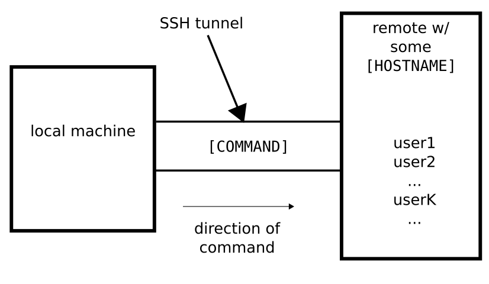

## Part 1: Efficiently using SSH

### What is SSH?

* protocol for securely connecting to another computer (we'll call it a _remote_) over a network
* uses client-server achitecture (one computer acts as server, other one as client)
* to verify you have it installed, simply run `ssh` in a terminal; if it's showing `usage: ...`, you're good to go


### SSH in practice

General syntax of the command:

```bash
ssh [OPTIONS] [USERNAME]@[HOSTNAME] [COMMAND]
```

* `[OPTIONS]`: any command-line flags that `ssh` supports (see later)
* `[USERNAME]` and `[HOSTNAME]`: login credentials, need to be known beforehand (`[USERNAME]` defaults to current `$USER`)
* `[HOSTNAME]`: IP address (`1.2.3.4`), or a domain[^resolution]
* `[COMMAND]`: the command we want to run on the remote. If no command is specified, usually (barring special options) it runs an interactive shell (like `bash`, `zsh`, or similar)

If you don't have any remotes to play around with, but your machine is running an openSSH server[^ssh-server], run:

```bash
ssh localhost
```

Congratulations, you just connected to your own remote!

To disconnect from a remote, either run `exit`, or press <kbd>Ctrl</kbd>+<kbd>D</kbd>.


[^resolution]: in general, anything your DNS or `/etc/hosts` file can resolve such as `google.com`
[^ssh-server]: on Debian-based Linux, you can install the `openssh-server` package, and run `sudo systemctl enable --now ssh` to start an openSSH server


### Schematic

What happens when we run:

```bash
ssh userK@[HOSTNAME] [COMMAND]
```



<p style="text-align:left;">
    [Previous](preface.md)
    <span style="float:right;">
    [Next](ssh_exercise.md)
    </span>
</p>
